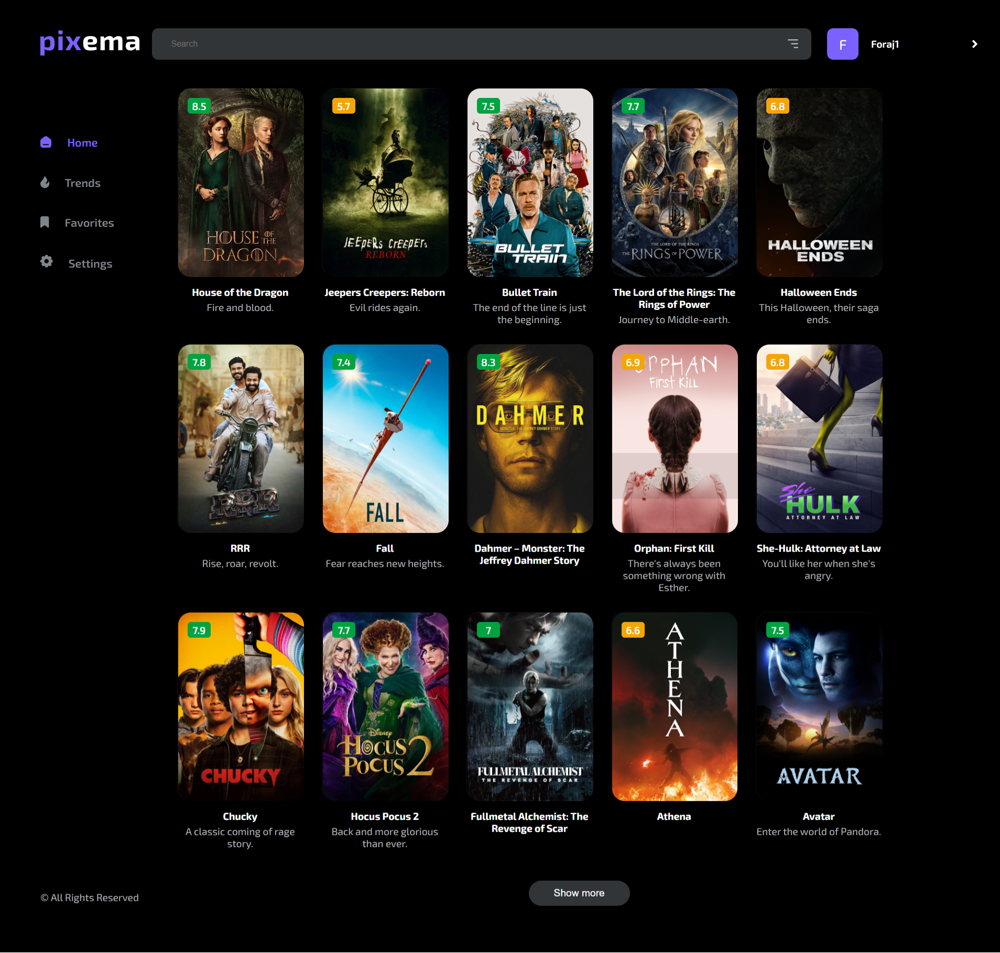

# Pixema
🎬 Pixema - is a service for selecting and obtaining information about a movies or series. It can be useful, for example, if you can't decide what to watch in the evening. 

## How to run
Load this link in your browser https://angrygru.github.io/pixema/

## How to use
First you need to log in or register.

The app has several tabs: 🏡Home, 📊Trends, 💛Favorites and ⚙️Settings.

You can select something from the new movies on the "Home" tab. Or the most highly rated trends, on the "Trends" tab. By clicking on a movie, you will get detailed information about it as well as recommendations of similar movies. The movie that you like can be postponed on the "Favorites" tab.  You can also use Search if you are looking for something specific. On the "Settings" tab, you can change the theme mode and also see some user data.

Implemented functionality: registration, login, search and filtering, pagination, theme mode change, routing, etc. 

## Stack
React(TypeScript), React-Router, Redux, Redux Toolkit, Redux-Saga, SCSS, Axios.
